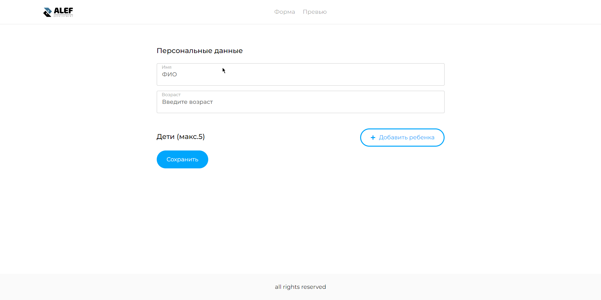

# Проект HH Me and Kids
Демонстрация функционала доступна по [ссылке](https://hh-me-and-kids.vercel.app)

## Описание проекта

Проект HH Me and Kids представляет собой веб-приложение с двумя страницами для управления информацией о себе и своих детях. Вот основные особенности проекта:

### Страница добавления информации

- На этой странице пользователь может вводить информацию о себе, а также добавлять информацию о своих детях.
- Для удобства предусмотрена кнопка для добавления детей и соответствующие поля для ввода информации.

### Страница вывода блочной информации

- На второй странице отображается блочная информация о пользователе и его детях.
- Используется Vue Router для перехода между страницами и Vuex для управления состоянием.

### UI Kit и хелпер для корректной информации

- Проект включает небольшой UI Kit, обеспечивающий приятный пользовательский интерфейс.
- Для обеспечения корректности информации (по падежам и названию лет/год/года) предусмотрен небольшой хелпер.

## Установка и запуск проекта

1. Склонируйте репозиторий на свой локальный компьютер.
2. Установите зависимости с помощью команды `npm install`.
3. Запустите проект с помощью команды `npm run serve`.
4. Откройте приложение в браузере по адресу `http://localhost:8080` (или другому, указанному в выводе консоли).

## Дополнительная информация

Для подробной информации о проекте и его компонентах обращайтесь к документации и комментариям в исходном коде.

## Связь:

- Telegram: https://t.me/LeylinV
- GitHub: https://github.com/LeylinV